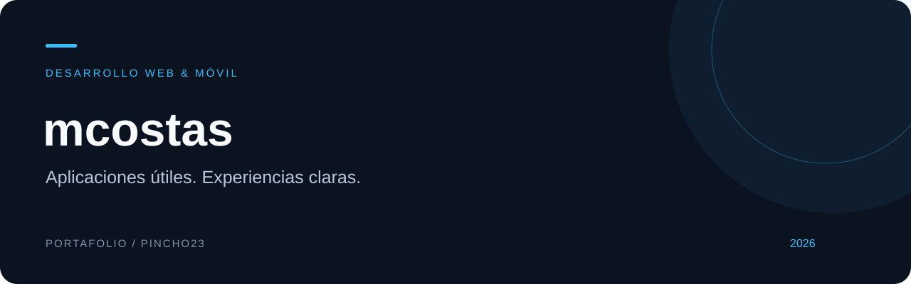

# Hola, soy Martin Costas

Desarrollo aplicaciones web y móviles enfocadas en necesidades cotidianas: organizar las finanzas del hogar y llevar un registro útil del entrenamiento.

Me interesa construir experiencias claras, cuidar la separación de datos entre usuarios y mantener la continuidad de uso cuando la conexión no acompaña.

### Proyectos destacados

| Proyecto | Problema que aborda | Explorar |
| :--- | :--- | :--- |
| **Finanzas en Pareja** | Registro y análisis compartido de movimientos del hogar. | [Ver caso de estudio →](https://github.com/pincho23/finanzas-en-pareja-portafolio) |
| **Ritmo Gym** | Diario de entrenamiento, historial y seguimiento del progreso. | [Ver caso de estudio →](https://github.com/pincho23/ritmo-gym-portafolio) |

### Tecnologías con las que trabajo

**Expo · React Native · TypeScript · Supabase · Python · Django**

### Cómo abordo los proyectos

- **Producto:** partir de una necesidad concreta y convertirla en flujos sencillos.
- **Experiencia:** facilitar el registro, la consulta y el seguimiento de información.
- **Datos:** separar el acceso por usuario u hogar según el contexto del producto.
- **Calidad:** comprobar las reglas importantes y documentar las limitaciones.

---

**Sobre este portafolio:** los repositorios de presentación contienen documentación y recursos visuales originales. No incluyen el código fuente de las aplicaciones, credenciales ni datos de usuarios.
